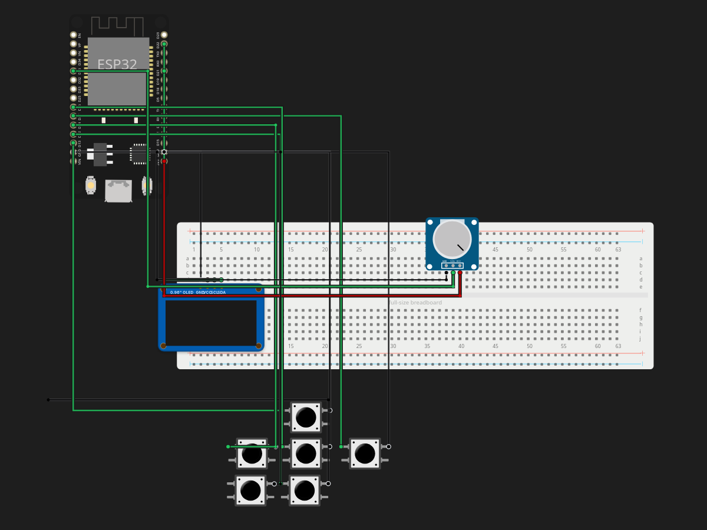

# ESP32 MP3 Player

> Built in [Breadboard](https://breadboard.hackclub.com), a Hack Club program. This project took ~7.4 hours of work.

## What It Does

I wanted to build a MP3 Player For a Long Time an i can Finally Build on e with Hack Club Breadboard. I am still missing some Parts in the Starter kit but it is going well.

## How It Works

The circuit is captured in `breadboard-project.json`, and the firmware that runs it is in the `firmware/` folder.

## How To Use It

MP3 Player with an ESP 32 Buttons SD Card slot and Working Headphone Jack. Still work in progress.

## Demo

- **Simulate it live:** [https://breadboard.hackclub.com/share/247](https://breadboard.hackclub.com/share/247), runs the firmware in the Breadboard simulator
- **View the design:** [https://taniwankenobi.github.io/breadboard-plays/p/247/](https://taniwankenobi.github.io/breadboard-plays/p/247/)

## Schematic

The editor snapshot is in `breadboard-project.json`.

## Bill of Materials

| Part | Quantity |
| --- | --- |
| breadboard-full | 1 |
| potentiometer | 1 |
| pushbutton | 6 |
| ssd1306-i2c | 1 |

## Firmware

Firmware files are in the `firmware/` folder.

## Build Journal

Build journal entries are kept in [`journals.md`](journals.md).

---

*Made in [Breadboard](https://breadboard.hackclub.com) — 7.4h of work*

